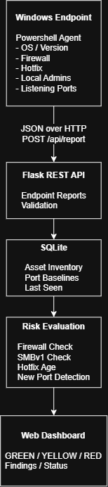
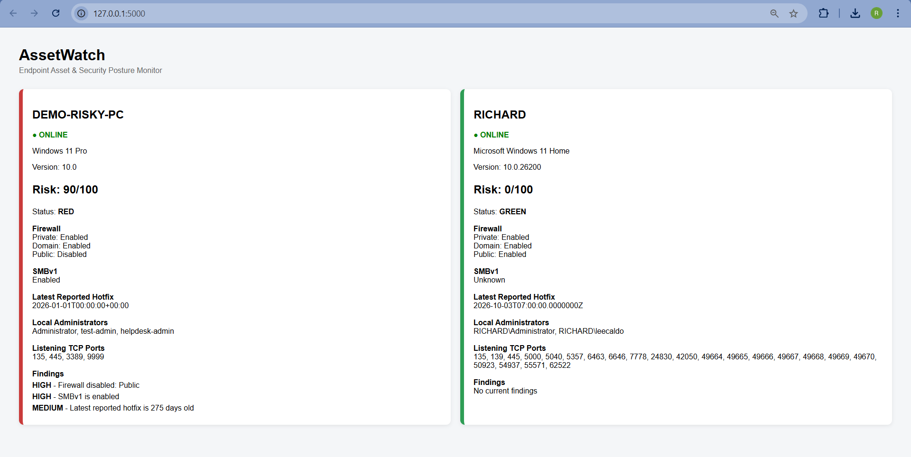

# AssetWatch

AssetWatch is a small Windows endpoint posture monitor built as a personal lab project.

A PowerShell agent collects basic host information and sends it to a Flask API. The server stores the latest report in SQLite and displays each endpoint on a simple dashboard.

## What it checks

- Windows version
- latest reported hotfix
- Windows Firewall profile status
- SMBv1 status
- local Administrators group
- listening TCP ports
- newly observed service ports

The first port report for a host is treated as its baseline. Later reports flag newly observed ports below the Windows dynamic/private port range.

## Run locally

```powershell
python -m venv .venv
.\.venv\Scripts\Activate.ps1
pip install -r requirements.txt
python app.py
```

In a second PowerShell window:

```powershell
.\agent.ps1
```

Open `http://127.0.0.1:5000`.

`demo_bad.ps1` sends a synthetic endpoint with intentionally weak settings so the RED state can be demonstrated without changing the host's security configuration.

## Limitations

This is an educational project, not a CIS or DISA STIG compliance scanner. The risk weights are simple lab values used to make the findings easy to visualize.

## Team Contributions

AssetWatch was developed collaboratively by two developers.

### Richard Lee
- PowerShell endpoint collection
- Endpoint/API integration
- Port-baseline testing

### Edward Lee
- Flask/SQLite backend
- Dashboard integration
- Architecture documentation

### Shared
- Project design
- Security posture rules
- Debugging and testing
- Documentation

## Architecture




